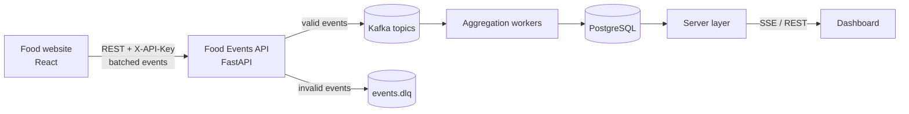

# Food Events API

Event ingestion service for the **Phenom Hack to Hire 2.0 — Domain C: Event-Driven Data Pipeline for Analytics** project.

The service sits between the food-ordering website and Kafka. It receives user-interaction events over REST, validates them against a versioned event contract, enriches them with server-side metadata, and publishes them to domain-specific Kafka topics. Downstream workers aggregate these events into the metrics shown on the analytics dashboard.

## Architecture



This repository covers the **event collection and ingestion layer**: the frontend tracking client, the ingestion API, and the Kafka producer. Aggregation, storage and the dashboard are implemented separately.

## Features

- **REST ingestion**: single-event and batch endpoints, protected by an API key.
- **Contract validation**: 14 event types, each with a typed payload schema (Pydantic).
- **Dead-letter queue**: invalid events are published to `events.dlq` with the validation error, never silently dropped.
- **Server-side enrichment**: `received_at`, `lateness_sec` and `clock_skew` on every event, plus delivery delay on `order_delivered`.
- **Topic routing and partitioning**: events are routed to domain topics and keyed by restaurant, preserving per-restaurant ordering.
- **Reliable delivery**: Kafka producer with `acks=all` and idempotence enabled.
- **Stateless**: no database; the service can be scaled horizontally behind a load balancer.
- **Local development mode**: without a Kafka cluster, events are written to a JSON Lines file.
- **Frontend client**: `events.js` batches events, retries on failure with the same `event_id`, and flushes on page close.
- **Traffic simulator**: generates realistic user journeys for testing the full pipeline without the frontend.

## Event model

### Envelope
Every event shares a common envelope. Fields marked *server* are added by the API.

```json
{
  "event_id": "5f2c...",                  // UUID, used for deduplication
  "event_type": "order_created",
  "schema_version": 1,
  "source": "web",                        // web | mobile | backend
  "event_time": "2026-09-30T07:30:00Z",   // when the event occurred (client clock, UTC)
  "user_id": "u_3fa1c9d2e0",
  "session_id": "b7e1...",
  "city": "hyderabad",
  "payload": { },
  "received_at": "2026-09-30T07:30:01Z",  // server
  "lateness_sec": 1.2,                    // server: received_at - event_time
  "clock_skew": false                     // server: client clock ahead by more than 5 minutes
}
```

### Event types and topics

| Topic | Event types |
|---|---|
| `events.user` | `user_register`, `user_login`, `session_started` |
| `events.browse` | `restaurant_viewed`, `price_filter_applied` |
| `events.cart` | `item_added_to_cart`, `item_removed_from_cart`, `checkout_started` |
| `events.payment` | `payment_success`, `payment_failed` |
| `events.order` | `order_created`, `order_delivered`, `order_cancelled` |
| `events.review` | `item_reviewed` |
| `events.dlq` | events that failed validation: `{reason, raw, received_at}` |

Payload fields for every event are documented in [`docs/FRONTEND_EVENTS.md`](docs/FRONTEND_EVENTS.md). The schemas are defined in [`app/event_schemas.py`](app/event_schemas.py) and exposed at `GET /api/v1/event-types`.

### Dashboard metrics supported

| Metric | Source event | Derivation |
|---|---|---|
| Region-wise feedback | `item_reviewed` | average `overall_rating` and tag counts by `city` |
| Peak order hours | `order_created` | count by hour of `event_time` (IST) |
| Most ordered item | `order_created` | sum of `items[].quantity` by `item_id` |
| Timestamp issues | `order_delivered`, all events | late deliveries (`is_late`, `delay_min`) and late-arriving events (`lateness_sec`) |

## Design decisions

**Schema evolution.** Payload models accept unknown fields, so producers can add fields without a coordinated release, and consumers ignore fields they do not use. Only required fields are enforced. Every event carries `schema_version`, which is incremented only for breaking changes, allowing consumers to handle old and new versions side by side.

**Late-arriving data.** Each event carries two timestamps: `event_time` (when it happened) and `received_at` (when it was ingested). Aggregation windows on `event_time`, so a late event updates the time bucket it belongs to rather than the current one. `lateness_sec` makes late data measurable, and `clock_skew` flags clients whose clocks are ahead of the server.

**Delivery guarantees.** The producer uses `acks=all` with idempotence, and the frontend retries failed requests with the original `event_id`. Together this gives at-least-once delivery with deduplication on `event_id` downstream.

**Validation at the edge.** Validating at ingestion keeps malformed data out of the pipeline. Rejected events go to a dead-letter topic so they can be inspected and replayed rather than lost.

**Partitioning.** Events are keyed by `restaurant_id` (falling back to `user_id` / `session_id`). All events for a restaurant land in the same partition, preserving their order and allowing per-restaurant aggregation without cross-partition coordination.

**Stateless service.** The API holds no state, so any number of instances can run in parallel.

## Project structure

```
food-backend/
├── app/
│   ├── main.py            # FastAPI app: authentication, ingestion endpoints, DLQ routing
│   ├── event_schemas.py   # Event envelope, payload schemas, topic mapping, enrichment
│   ├── producer.py        # Kafka producer and local file fallback
│   └── config.py          # Environment-based configuration (.env)
├── frontend/
│   └── events.js          # Tracking client for the React app
├── scripts/
│   ├── simulate.py        # Realistic traffic generator
│   ├── check_kafka.py     # End-to-end connectivity check
│   ├── create_topics.py   # Creates Kafka topics
│   └── consume.py         # Tails topics for verification
├── docs/
│   ├── FRONTEND_EVENTS.md # Frontend integration guide
│   └── KAFKA_CONTRACT.md  # Contract for the aggregation layer
├── requirements.txt
├── .env.example           # Configuration template
├── .env                   # Local configuration with credentials (not committed)
└── ca.pem                 # Aiven CA certificate (not committed)
```

## Getting started

### Prerequisites
- Python 3.10 or later (`python3 --version`)
- Access to the team's Aiven for Apache Kafka service

### 1. Install
```bash
python3 -m venv venv
source venv/bin/activate          # Windows: venv\Scripts\activate
pip install --upgrade pip
pip install -r requirements.txt
```

### 2. Configure
The service is pre-configured for the team's Aiven Kafka cluster:

| Setting | Value |
|---|---|
| Bootstrap server | `kafka-182d885c-pranithreddy16-c8b4.c.aivencloud.com:28672` |
| Security protocol | `SASL_SSL` |
| SASL mechanism | `SCRAM-SHA-256` |
| Username | `avnadmin` |
| CA certificate | `ca.pem` (project root) |

Credentials live in `.env` and `ca.pem` in the project root. If they are missing (for example after a fresh clone), create them:
```bash
cp .env.example .env              # then set KAFKA_SASL_PASSWORD and API_KEY
```
and save the CA certificate from the Aiven console (**Connect information → CA certificate**) as `ca.pem`.

Both files contain secrets and are excluded from Git.

### 3. Verify the Kafka connection
```bash
python scripts/check_kafka.py
```
This connects to the cluster, lists topics and produces a test message. If topics are missing, create them (Aiven disables topic auto-creation):
```bash
python scripts/create_topics.py
```

### 4. Run the API
```bash
uvicorn app.main:app --host 0.0.0.0 --port 8000 --reload
```
- Health check: `http://localhost:8000/health` (`"kafka": true` when Kafka is configured)
- Interactive API docs: `http://localhost:8000/docs`

On startup the API logs whether it reached Kafka and warns about missing topics.

### 5. Send events
Until the frontend is ready, generate traffic with the simulator (in a second terminal):
```bash
python scripts/simulate.py --sessions 500 --backfill-days 7
python scripts/consume.py events.order     # watch events arrive in Kafka
```

### Local mode (no Kafka)
Set `KAFKA_BOOTSTRAP_SERVERS=` (empty) in `.env`. Events are then logged to the console and appended to `events_out.jsonl`.

### Troubleshooting

| Symptom | Cause / fix |
|---|---|
| `Broker transport failure` | Wrong host/port, the Aiven service is powered off, or a network/firewall block |
| `Authentication failed` | Wrong username or password, or wrong `KAFKA_SASL_MECHANISM` |
| `SSL handshake failed` / certificate error | `ca.pem` missing or not the certificate from this Aiven project |
| `Unknown topic or partition` | Topic not created; run `scripts/create_topics.py` |
| Topic creation fails with a quota error | Plan topic limit reached; set `KAFKA_SINGLE_TOPIC` to publish to one topic |
| Browser shows a CORS error | Add the frontend origin to `CORS_ORIGINS` |

## Configuration

| Variable | Default | Description |
|---|---|---|
| `API_KEY` | `dev-key-change-me` | Shared secret expected in the `X-API-Key` header |
| `KAFKA_BOOTSTRAP_SERVERS` | *(empty)* | Kafka brokers; empty enables file output mode |
| `KAFKA_SECURITY_PROTOCOL` | *(empty)* | `SASL_SSL` for Aiven and most managed Kafka |
| `KAFKA_SASL_MECHANISM` | *(empty)* | `SCRAM-SHA-256` for Aiven |
| `KAFKA_SASL_USERNAME` / `KAFKA_SASL_PASSWORD` | *(empty)* | SASL credentials |
| `KAFKA_SSL_CA_LOCATION` | *(empty)* | Path to the cluster CA certificate (e.g. `ca.pem`) |
| `TOPIC_USER`, `TOPIC_ORDER`, ... `TOPIC_DLQ` | `events.*` | Override individual topic names to match an existing cluster |
| `KAFKA_SINGLE_TOPIC` | *(empty)* | Publish all valid events to one topic (consumers filter on `event_type`) |
| `CORS_ORIGINS` | `*` | Allowed frontend origins, comma-separated |
| `MAX_BATCH_SIZE` | `100` | Maximum events per batch request |
| `EVENTS_FILE` | `events_out.jsonl` | Output file when Kafka is not configured |

## API reference

All `/api/v1` endpoints require the `X-API-Key` header.

| Method | Path | Description |
|---|---|---|
| `GET` | `/health` | Liveness check; reports whether Kafka is configured |
| `GET` | `/api/v1/event-types` | Supported event types, their topics and payload JSON schemas |
| `POST` | `/api/v1/events` | Ingest one event. `202` if accepted, `422` with the reason if invalid |
| `POST` | `/api/v1/events/batch` | Ingest up to 100 events: `{"events": [...]}`. Valid events are accepted even if others are rejected |

**Example**
```bash
curl -X POST http://localhost:8000/api/v1/events/batch \
  -H "X-API-Key: dev-key-change-me" -H "Content-Type: application/json" \
  -d '{"events": [{
        "event_type": "item_added_to_cart",
        "event_time": "2026-09-30T07:30:00Z",
        "user_id": "u_3fa1c9d2e0", "city": "hyderabad",
        "payload": {"item_id": "i_101", "name": "Chicken Biryani", "category": "main",
                    "unit_price": 280, "quantity": 1, "restaurant_id": "r_88"}
      }]}'
```
```json
{"accepted": 1, "rejected": 0, "errors": []}
```

## Testing with simulated traffic

The simulator generates realistic journeys and sends them through the API, exercising the full pipeline:
```bash
python scripts/simulate.py --sessions 100                     # current time
python scripts/simulate.py --sessions 1000 --backfill-days 7  # spread across the last 7 days
```
It models lunch and dinner peaks, item popularity, abandoned carts, failed payments, cancellations, late deliveries (with lower ratings), and reviews that arrive days after the order.

## Integration

- **Frontend:** add `frontend/events.js` to the React app and follow [`docs/FRONTEND_EVENTS.md`](docs/FRONTEND_EVENTS.md).
- **Aggregation layer:** consume the topics described in [`docs/KAFKA_CONTRACT.md`](docs/KAFKA_CONTRACT.md).

## Limitations and future work

- **Authentication** uses a single shared API key, which is visible in the browser. Production would use per-client keys or signed tokens.
- **Tenant isolation** is not enforced at this layer: `restaurant_id` is supplied by the client. Production would derive the tenant from the credential and enforce it at ingestion, storage and query time.
- **Trust boundary:** business events such as payments and orders originate in the browser. In production they should be emitted by a backend after the transaction is committed.
- **Schema registry:** schemas live in code. At larger scale, a schema registry (Avro or Protobuf) would enforce compatibility rules centrally.
- **Deduplication** is left to consumers; the API does not track seen `event_id`s.
